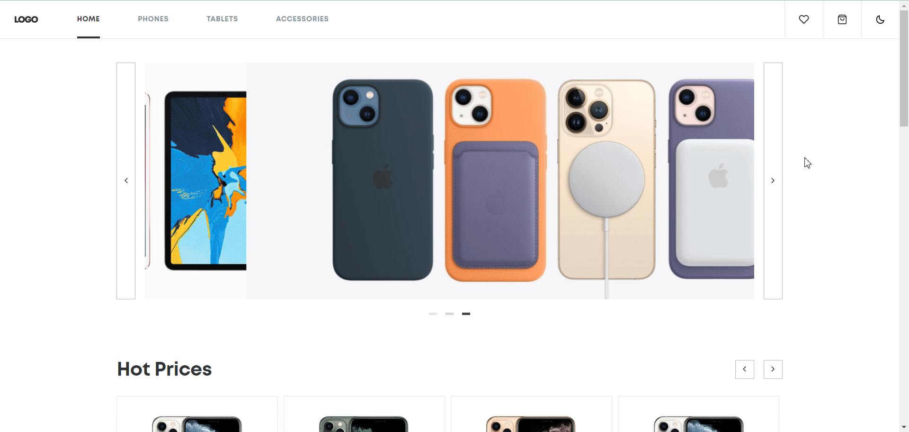
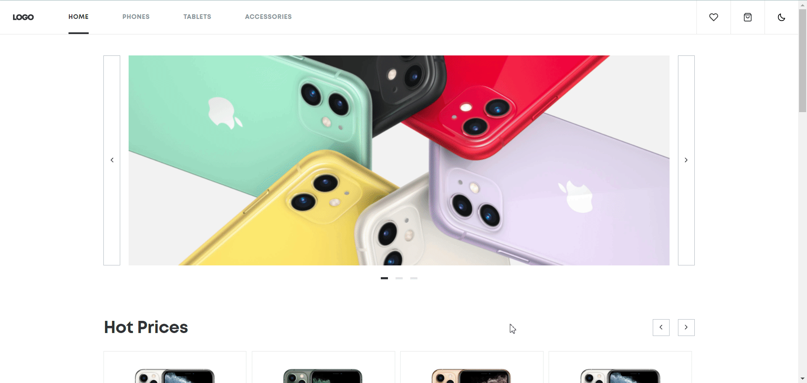
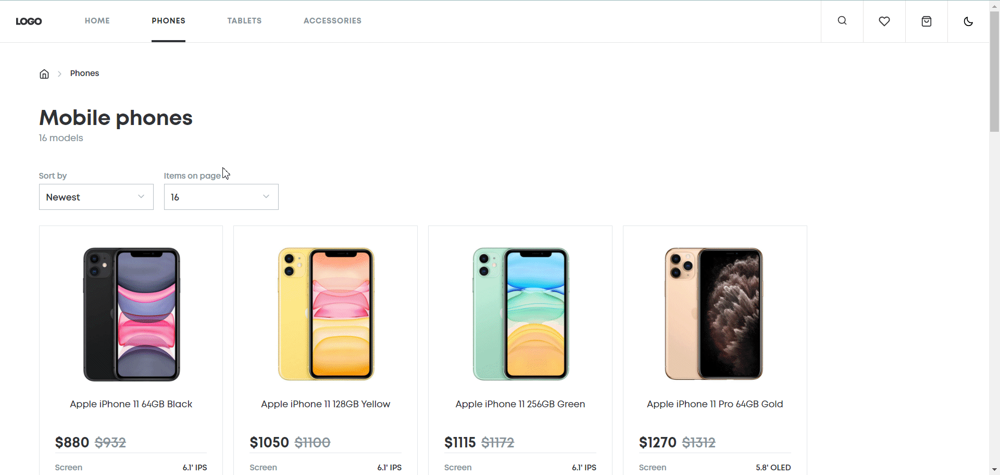

# Phone Sphere Catalog

## Introduction

This visually appealing and fully responsive project is tailored to showcase a diverse range of mobile phones. It provides users with a seamless interface for effortless browsing and efficient search capabilities for different phone models. The catalog delivers comprehensive information, including specifications and images, empowering users to make informed choices.

### [🚀 DEMO](https://bojkovladislav.github.io/phone-sphere-catalog)

**Sections:**

- [Features](#features)
- [Technologies](#technologies)

## Features

Explore the exciting features that make the Phone Sphere Catalog stand out:

### User-Friendly Interface

The catalog boasts an intuitive and user-friendly design, ensuring a smooth and enjoyable experience for users navigating through the phone models.

### Dark and Light Themes 🌗

The application comes with both Dark and Light themes to accommodate diverse user preferences. A theme icon in the header allows users to effortlessly switch between themes, and the chosen theme is persistently saved in local storage.

### Product overview 🖥️

Users have the flexibility to customize the number of products displayed on the page, tailoring the viewing experience to their preferences.

### Search

Users have an ability to find product by searching it, making it much easier to get a desired gadget.

### Sorting and Filtering 🔄

Efficiently sort and filter products based on user preferences. Users can easily organize products, making it convenient to find the perfect mobile phone.

### Cart and Favorites ❤️

Seamlessly add products to the cart or mark them as favorites. This feature enhances user interaction, providing a personalized and convenient shopping experience.

### Pagination 📖

Pagination is implemented to enhance the user experience by breaking down the display of products into manageable sections. Users can navigate through the catalog with ease.

## Technologies

The Phone Sphere Catalog leverages a powerful stack of technologies:

### React.js

Built with React.js library, ensuring a modular and efficient development process.

### Redux 🔄

Utilizes Redux for state management, providing a centralized and predictable way to manage application state.

### Custom Hooks ⚓

Implementation of custom hooks to encapsulate and reuse logic, promoting code maintainability and readability.

### TypeScript 📝

Developed using TypeScript for static typing, enhancing code quality and developer productivity.

### Sass 🎨

Sass is used as the CSS preprocessor for creating modular and maintainable styles.

### Classnames 🖋️

The Classnames library is employed to conditionally apply CSS class names based on certain conditions. This simplifies the process of dynamically managing class names in React components, making the code more readable and expressive.

### Bulma 📐

Bulma is utilized as the CSS framework to provide a responsive and consistent grid system, as well as a set of modern UI components. This choice enhances the overall aesthetic appeal and responsiveness of the Phone Sphere Catalog, contributing to a polished and professional user interface.

### Axios 🌐

Incorporates Axios for efficient HTTP requests, enabling seamless communication with external APIs.

### Local Storage

Utilizes local storage to persistently store and retrieve user preferences, such as the selected theme.

## [🔝 Back to Top](#React-Phone-Catalog)
